# Port Scanning
```bash
❯ rustscan -a 10.49.143.242 -- -A

Open 10.49.143.242:22
Open 10.49.143.242:80

PORT   STATE SERVICE REASON         VERSION
22/tcp open  ssh     syn-ack ttl 62 OpenSSH 7.2p2 Ubuntu 4ubuntu2.10 (Ubuntu Linux; protocol 2.0)
| ssh-hostkey: 
|   2048 95:c3:ce:af:07:fa:e2:8e:29:04:e4:cd:14:6a:21:b5 (RSA)
| ssh-rsa AAAAB3NzaC1yc2EAAAADAQABAAABAQDn0l/KSmAk6LfT9R73YXvsc6g8qGZvMS+A5lJ19L4G5xbhSpCoEN0kBEZZQfI80sEU7boAfD0/VcdFhURkPxDUdN1wN7a/4alpMMMKf2ey0tpnWTn9nM9JVVI9rloaiD8nIuLesjigq+eEQCaEijfArUtzAJpESwRHrtm2OWTJ+PYNt1NDIbQm1HJHPasD7Im/wW6MF04mB04UrTwhWBHV4lziH7Rk8DYOI1xxfzz7J8bIatuWaRe879XtYA0RgepMzoXKHfLXrOlWJusPtMO2x+ATN2CBEhnNzxiXq+2In/RYMu58uvPBeabSa74BthiucrdJdSwobYVIL27kCt89
|   256 4d:99:b5:68:af:bb:4e:66:ce:72:70:e6:e3:f8:96:a4 (ECDSA)
| ecdsa-sha2-nistp256 AAAAE2VjZHNhLXNoYTItbmlzdHAyNTYAAAAIbmlzdHAyNTYAAABBBKJLaFNlUUzaESL+JpUKy/u7jH4OX+57J/GtTCgmoGOg4Fh8mGqS8r5HAgBMg/Bq2i9OHuTMuqazw//oQtRYOhE=
|   256 0d:e5:7d:e8:1a:12:c0:dd:b7:66:5e:98:34:55:59:f6 (ED25519)
|_ssh-ed25519 AAAAC3NzaC1lZDI1NTE5AAAAIJvvZ5IaMI7DHXHlMkfmqQeKKGHVMSEYbz0bYhIqPp62
80/tcp open  http    syn-ack ttl 62 Apache httpd 2.4.18 ((Ubuntu))
| http-methods: 
|_  Supported Methods: OPTIONS GET HEAD POST
|_http-title: Site doesn't have a title (text/html).
| http-robots.txt: 9 disallowed entries 
| /workshop/ /root/ /lol/ /agent/ /feed /crawler /boot 
|_/comingreallysoon /interesting
|_http-server-header: Apache/2.4.18 (Ubuntu)
Warning: OSScan results may be unreliable because we could not find at least 1 open and 1 closed port
Device type: general purpose|phone|specialized
Running (JUST GUESSING): Linux 4.X|5.X|6.X (96%), Google Android 10.X|11.X|12.X (93%), Adtran embedded (92%)
OS CPE: cpe:/o:linux:linux_kernel:4 cpe:/o:linux:linux_kernel:5 cpe:/o:google:android:10 cpe:/o:google:android:11 cpe:/o:google:android:12 cpe:/o:linux:linux_kernel:6 cpe:/h:adtran:424rg
OS fingerprint not ideal because: Missing a closed TCP port so results incomplete
Aggressive OS guesses: Linux 4.15 - 5.19 (96%), Linux 4.15 (96%), Linux 5.4 - 5.15 (96%), Android 10 - 12 (Linux 4.14 - 4.19) (93%), Linux 5.14 - 6.8 (93%), Adtran 424RG FTTH gateway (92%), Android 10 - 11 (Linux 4.9 - 4.14) (92%), Android 12 (Linux 5.4) (92%), Android 9 - 11 (Linux 4.9 - 4.14) (92%), Linux 2.6.32 (92%)
No exact OS matches for host (test conditions non-ideal).
```
First I visited the website. <br/>
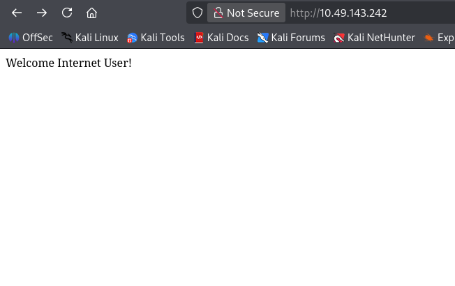 <br/>
In robots.txt I found <br/>
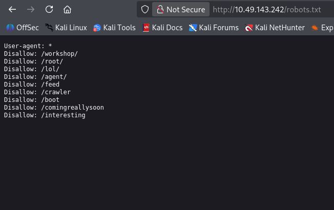 <br/>
All the pages give pages respond with 404. But `/comingreallysoon` replied: <br/>
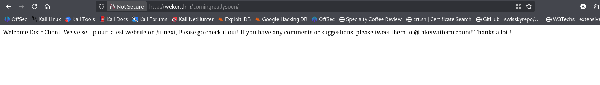 <br/>
I visited `/it-next` <br/>
 <br/>
Bruteforcing the vhost I have found. <br/>
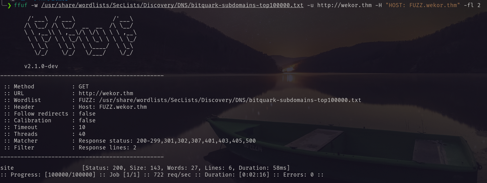 <br/>
Adding this to the `/etc/hosts` file, I visited the site. <br/>
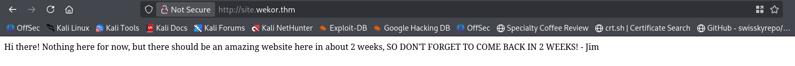 <br/>
I again bruteforce for directory. <br/>
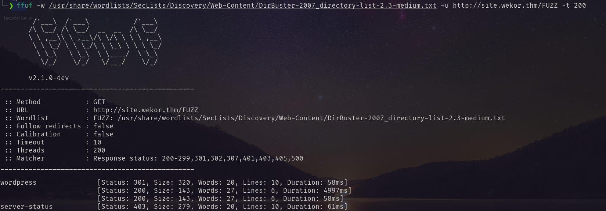 <br/>
Found `/wordpress`. <br/>
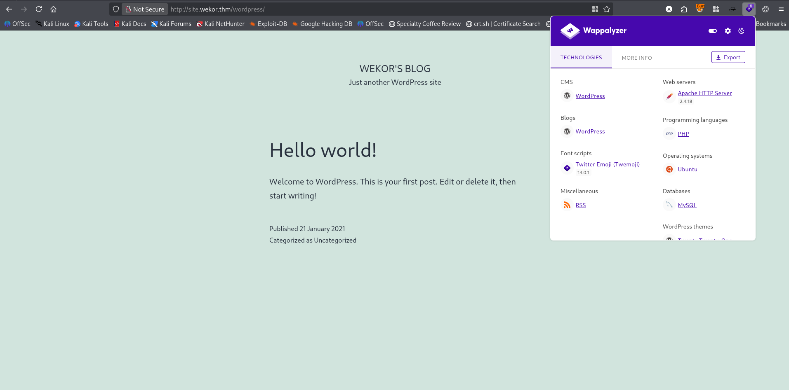 <br/>
So first I started enumerating the first website. After checking everything at last I found the coupon in cart page has SQLI vulnerability.  <br/>
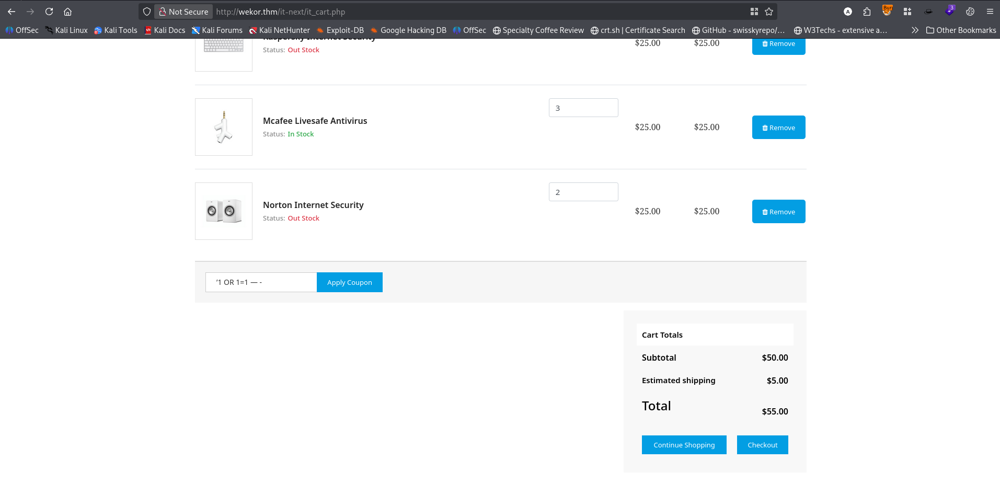 <br/>
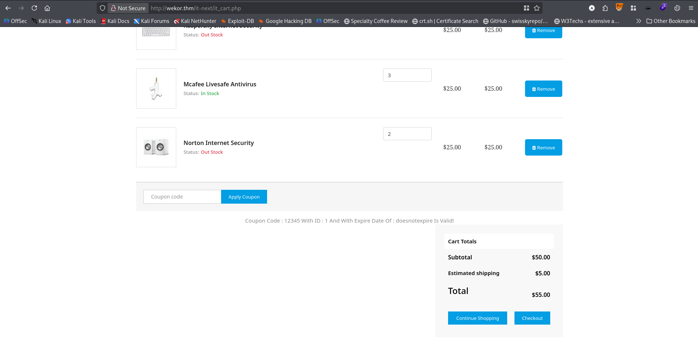 <br/>
Using sqlmap I dump the databases. <br/>
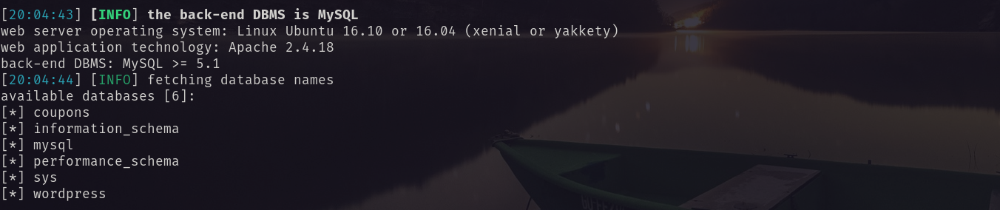 <br/>
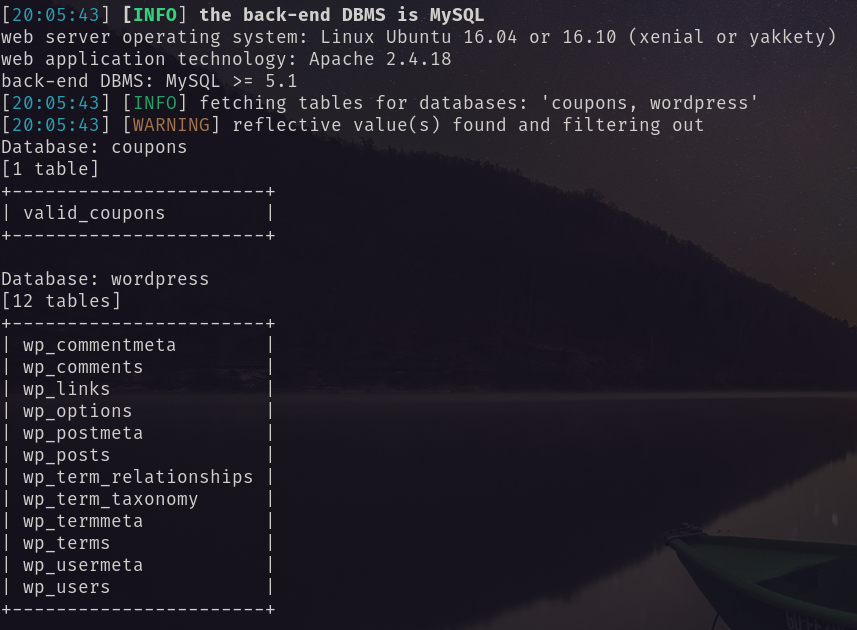 <br/>
Form `wp_users` table I have found the following users.  <br/>
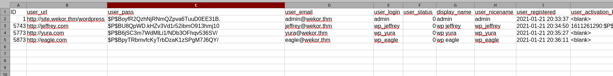 <br/>
Using `jhon` I cracked the hashes. <br/>
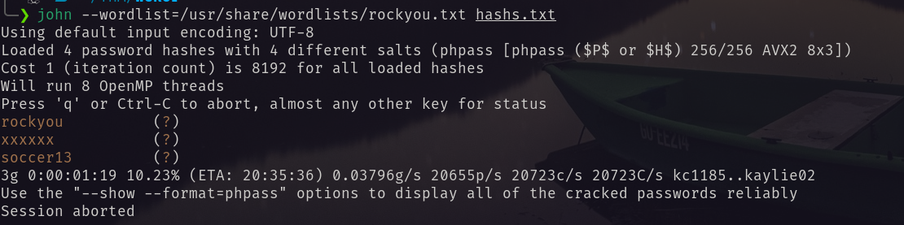 <br/>
Using the credential `wp_yura:soccer13` I logged in as wp_yura. <br/>
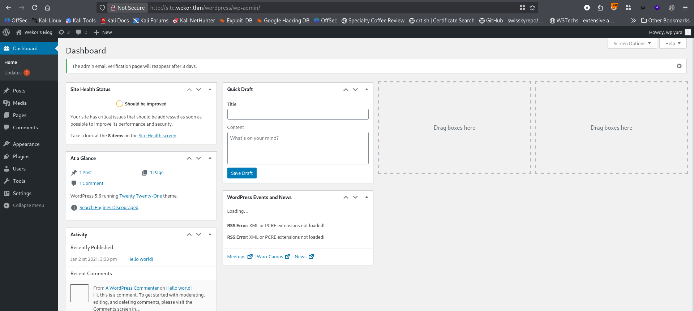 <br/>
This user has admin privilege. <br/>
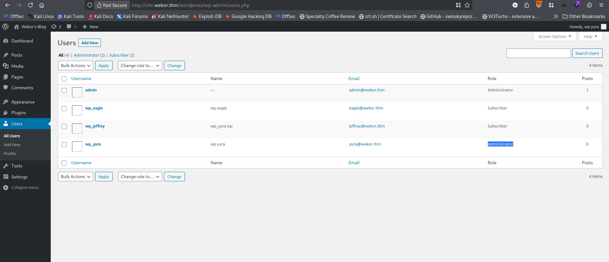 <br/>
I edited the 404 page of template Twenty Twenty-One with php reverse shell. <br/>
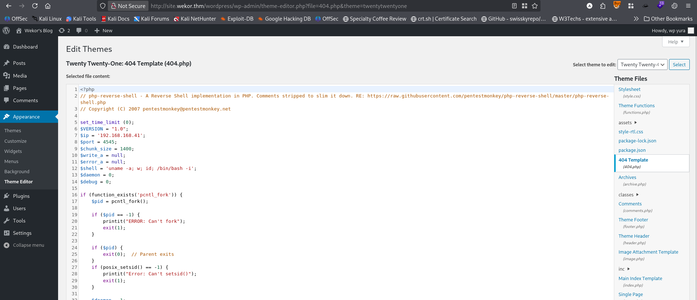 <br/>
And got the shell. <br/>
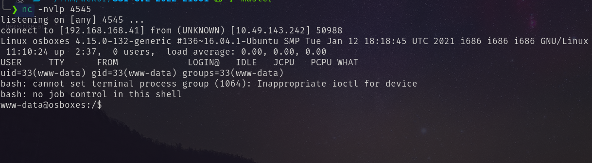 <br/>
At `/etc/passwd` page I found user `Orka`. <br/>
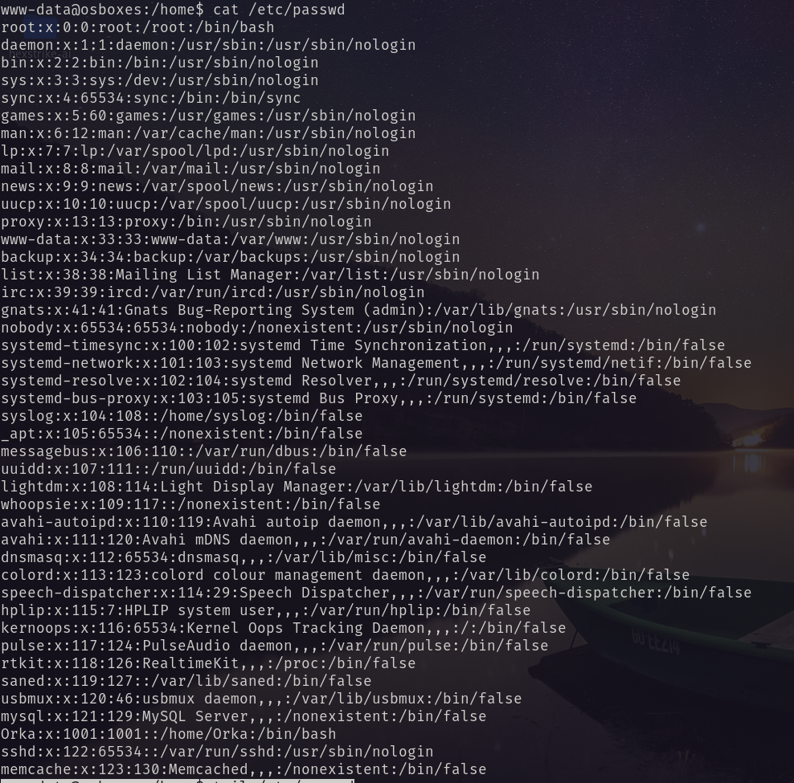 <br/>
Running `linpeas.sh` I have found an interesting port 11211 for internal connection. <br/>
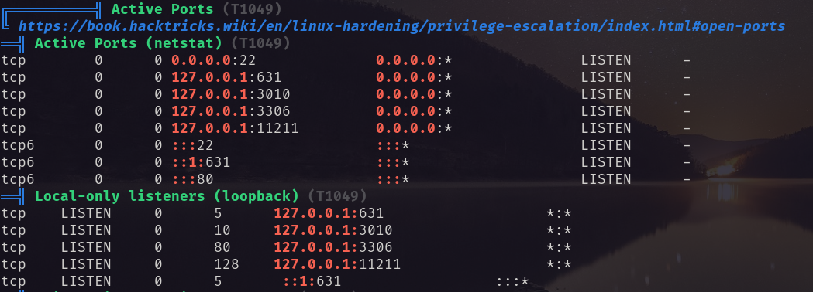 <br/>
Googling about this I have found it is Memcached. It is a high-performance, distributed memory caching system designed to speed up dynamic web applications by alleviating database load. It stores data in RAM as key-value pairs for quick retrieval. So I started enumerating it. <br/>
1. Connected to the port with `nc`
2. Checked the version with `version`
3. Checked the general stats with `stats` 
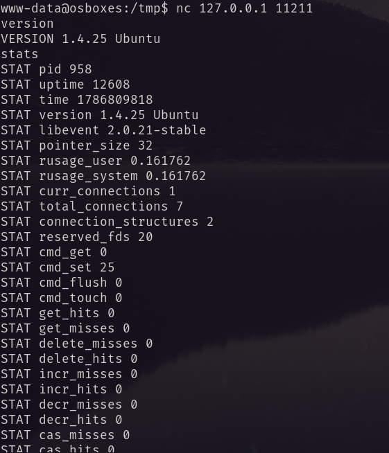 <br/>
4. Dump keys from slab with `stats cachedump 1 100`, I found four keys. I dump the value with `get key_name` <br/>
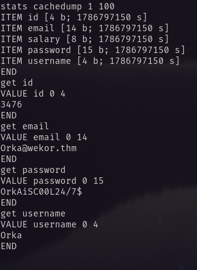 <br/>
So, I found username and password. Using it I logged in via ssh. <br/>
I got the first flag. <br/>
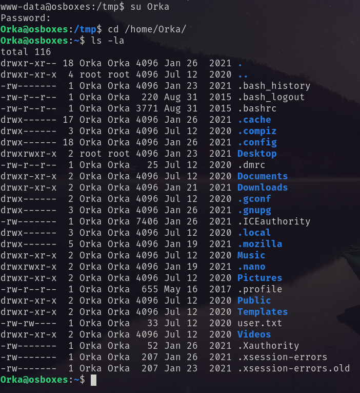 <br/>
# Privilege Escalation
Running `sudo -l` <br/>
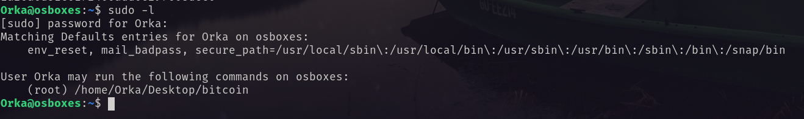 <br/>
I wen to the Desktop folder and found the binary and a python file. <br/>
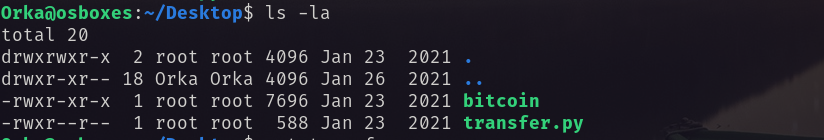 <br/>
I downloaded the binary and reversing it found the password is `password`. And it is directly calling `python`. So need path manipulation. <br/>
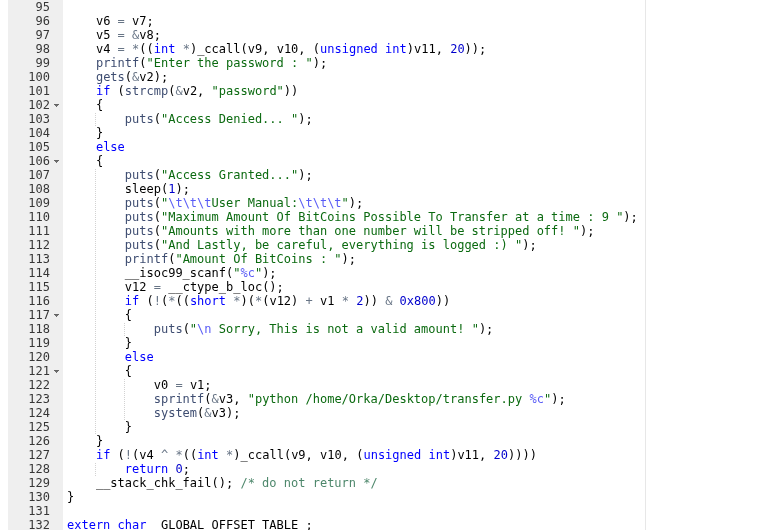 <br/>
As it set secure path, so I had to use only that directories. `/usr/sbin` had write permission. <br/>
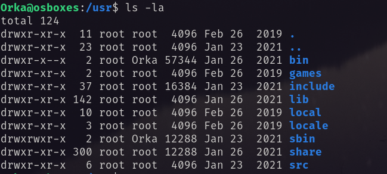 <br/>
I followed the following:
1. `echo -e 'chmod +s /bin/bash' > /usr/sbin/python`
2. `chmod +x /usr/sbin/pytohn`
3. `sudo /home/Orka/Desktop/bitcoin`
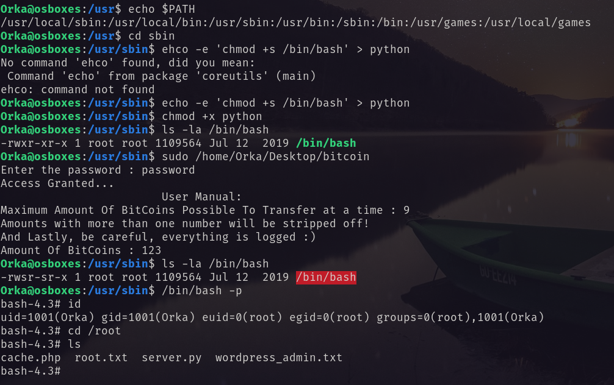 <br/>