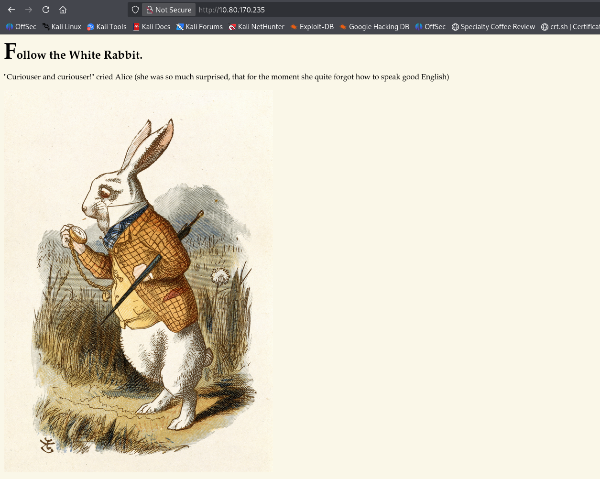
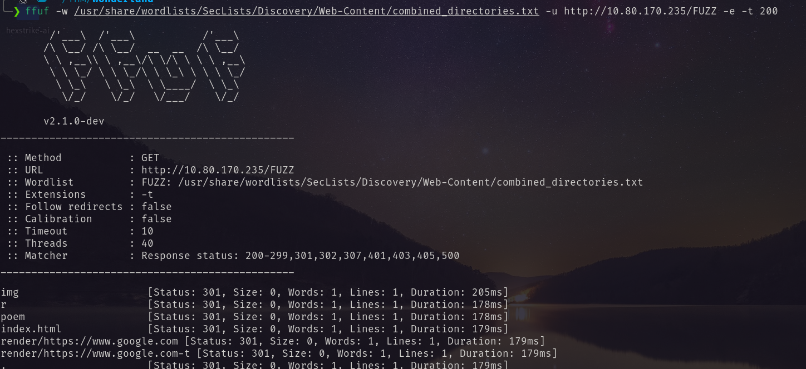
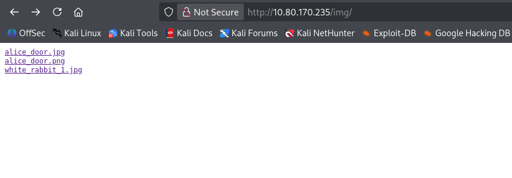
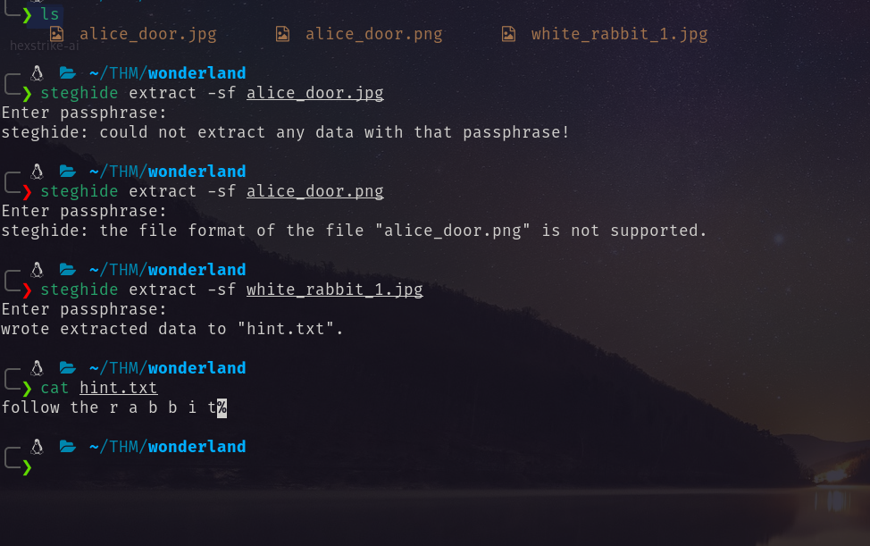
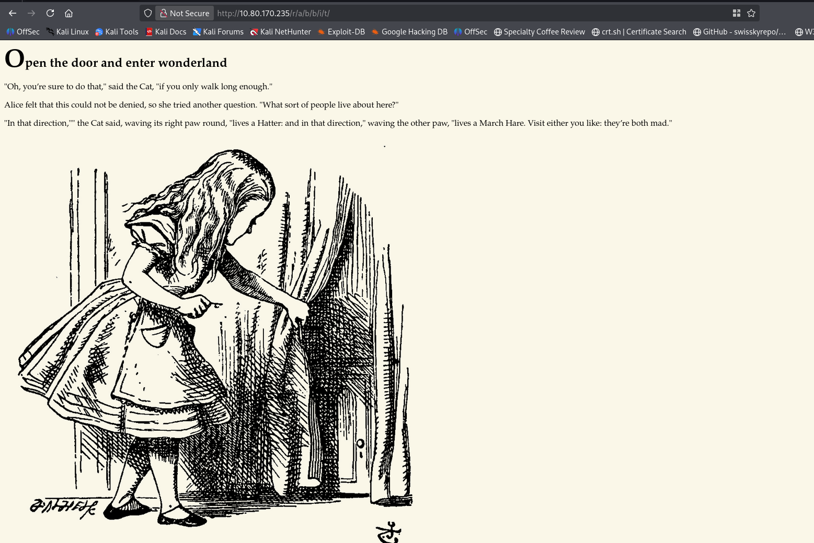
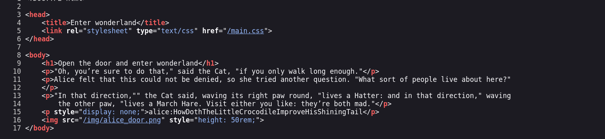
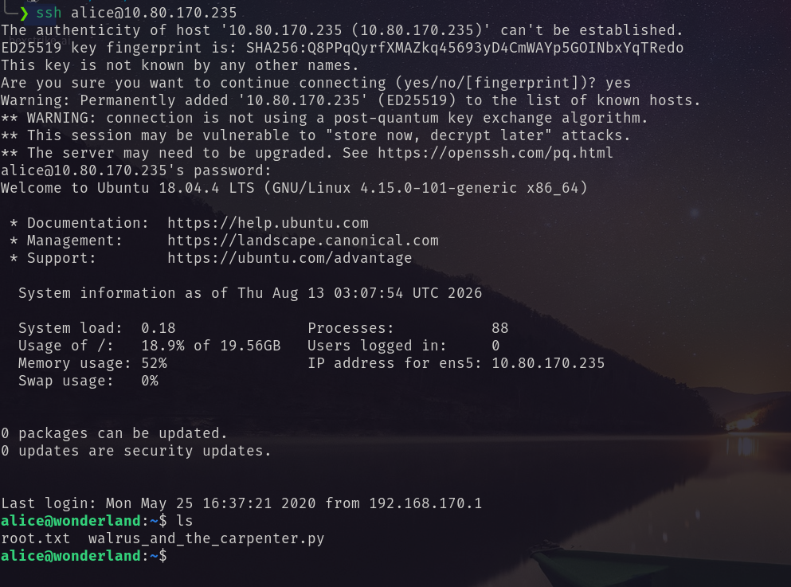
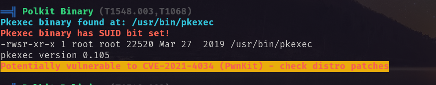
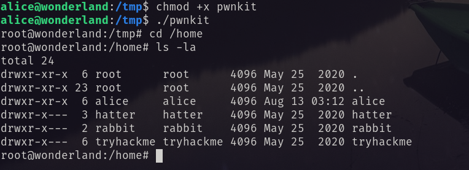

# Port Scanning
```bash
❯ rustscan -a 10.80.170.235 -- -A

Open 10.80.170.235:22
Open 10.80.170.235:80

PORT   STATE SERVICE REASON         VERSION
22/tcp open  ssh     syn-ack ttl 62 OpenSSH 7.6p1 Ubuntu 4ubuntu0.3 (Ubuntu Linux; protocol 2.0)
| ssh-hostkey: 
|   2048 8e:ee:fb:96:ce:ad:70:dd:05:a9:3b:0d:b0:71:b8:63 (RSA)
| ssh-rsa AAAAB3NzaC1yc2EAAAADAQABAAABAQDe20sKMgKSMTnyRTmZhXPxn+xLggGUemXZLJDkaGAkZSMgwM3taNTc8OaEku7BvbOkqoIya4ZI8vLuNdMnESFfB22kMWfkoB0zKCSWzaiOjvdMBw559UkLCZ3bgwDY2RudNYq5YEwtqQMFgeRCC1/rO4h4Hl0YjLJufYOoIbK0EPaClcDPYjp+E1xpbn3kqKMhyWDvfZ2ltU1Et2MkhmtJ6TH2HA+eFdyMEQ5SqX6aASSXM7OoUHwJJmptyr2aNeUXiytv7uwWHkIqk3vVrZBXsyjW4ebxC3v0/Oqd73UWd5epuNbYbBNls06YZDVI8wyZ0eYGKwjtogg5+h82rnWN
|   256 7a:92:79:44:16:4f:20:43:50:a9:a8:47:e2:c2:be:84 (ECDSA)
| ecdsa-sha2-nistp256 AAAAE2VjZHNhLXNoYTItbmlzdHAyNTYAAAAIbmlzdHAyNTYAAABBBHH2gIouNdIhId0iND9UFQByJZcff2CXQ5Esgx1L96L50cYaArAW3A3YP3VDg4tePrpavcPJC2IDonroSEeGj6M=
|   256 00:0b:80:44:e6:3d:4b:69:47:92:2c:55:14:7e:2a:c9 (ED25519)
|_ssh-ed25519 AAAAC3NzaC1lZDI1NTE5AAAAIAsWAdr9g04J7Q8aeiWYg03WjPqGVS6aNf/LF+/hMyKh
80/tcp open  http    syn-ack ttl 62 Golang net/http server (Go-IPFS json-rpc or InfluxDB API)
| http-methods: 
|_  Supported Methods: GET HEAD POST OPTIONS
|_http-title: Follow the white rabbit.
Warning: OSScan results may be unreliable because we could not find at least 1 open and 1 closed port
Device type: general purpose|phone|specialized
Running (JUST GUESSING): Linux 4.X|5.X|6.X (96%), Google Android 10.X|11.X|12.X (93%), Adtran embedded (92%)
OS CPE: cpe:/o:linux:linux_kernel:4 cpe:/o:linux:linux_kernel:5 cpe:/o:google:android:10 cpe:/o:google:android:11 cpe:/o:google:android:12 cpe:/o:linux:linux_kernel:6 cpe:/h:adtran:424rg
OS fingerprint not ideal because: Missing a closed TCP port so results incomplete
Aggressive OS guesses: Linux 4.15 - 5.19 (96%), Linux 4.15 (95%), Linux 5.4 - 5.15 (95%), Android 10 - 12 (Linux 4.14 - 4.19) (93%), Linux 5.14 - 6.8 (93%), Adtran 424RG FTTH gateway (92%), Android 10 - 11 (Linux 4.9 - 4.14) (92%), Android 9 - 11 (Linux 4.9 - 4.14) (92%), Linux 2.6.32 (92%), Linux 2.6.39 - 3.2 (92%)
No exact OS matches for host (test conditions non-ideal).
```
So I visited the website first. <br/>
 <br/>
Then bruteforce the directory and found the following. <br/>
 <br/>
In the image directory I found three images. <br/>
 <br/>
I downloaded the images. And perform steghide. One of the image give me a directory hint. <br/>
 <br/>
Following the hint I found a page. <br/>
 <br/>
In the source code I found: <br/>
 <br/>
SSH login credential for alice: <br/>
`alice:HowDothTheLittleCrocodileImproveHisShiningTail` <br/>
Using this I logged in as alice. <br/>
 <br/>
After that I ran `linpeas.sh` and found that it has pkexec vulnerability.  <br/>
 <br/>
Abusing this I got root shell. <br/>
 <br/>