# Port Scanning
```bash
❯ rustscan -a 10.48.164.69 -- -A

Open 10.48.164.69:22
Open 10.48.164.69:80

PORT   STATE SERVICE REASON         VERSION
22/tcp open  ssh     syn-ack ttl 62 OpenSSH 6.6.1p1 Ubuntu 2ubuntu2 (Ubuntu Linux; protocol 2.0)
| ssh-hostkey: 
|   1024 14:6b:67:4c:1e:89:eb:cd:47:a2:40:6f:5f:5c:8c:c2 (DSA)
| ssh-dss AAAAB3NzaC1kc3MAAACBAPe2PVDHBBlUCEtHNVxjToY/muZpZ4hrISDM7fuGOkh/Lp9gAwpEh24Y/u197WBDTihDJsDZJqrJEJSWbpiZgReyh1LtJTt3ag8GrUUDJCNx6lLUIWR5iukdpF7A2EvV4gFn7PqbmJmeeQRtB+vZJSp6VcjEG0wYOcRw2Z6N6ho3AAAAFQCg45+RiUGvOP0QLD6PPtrMfuzdQQAAAIEAxCPXZB4BiX72mJkKcVJPkqBkL3t+KkkbDCtICWi3d88rOqPAD3yRTKEsASHqSYfs6PrKBd50tVYgeL+ss9bP8liojOI7nP0WQzY2Zz+lfPa+d0uzGPcUk0Wg3EyLLrZXipUg0zhPjcXtxW9+/H1YlnIFoz8i/WWJCVaUTIR3JOoAAACBAMJ7OenvwoThUw9ynqpSoTPKYzYlM6OozdgU9d7R4XXgFXXLXrlL0Fb+w7TT4PwCQO1xJcWp5xJHi9QmXnkTvi386RQJRJyI9l5kM3E2TRWCpMMQVHya5L6PfWKf08RYGp0r3QkQKsG1WlvMxzLCRsnaVBqCLasgcabxY7w6e2EM
|   2048 66:42:f7:91:e4:7b:c6:7e:47:17:c6:27:a7:bc:6e:73 (RSA)
| ssh-rsa AAAAB3NzaC1yc2EAAAADAQABAAABAQCkDLTds2sLmn9AZ0KAl70Fu5gfx5T6MDJehrsCzWR3nIVczHLHFVP+jXDzCcB075jjXbb+6IYFOdJiqgnv6SFxk85kttdvGs/dnmJ9/btJMgqJI0agbWvMYlXrOSN26Db3ziUGrddEjTT74Z1kokg8d7uzutsfZjxxCn0q75NDfDpNNMLlstOEfMX/HtOUaLQ47IeuSpaQoUkNkHF2SGoTTpbC+avzcCNHRIZEwQ6HdA3vz1OY6TnpAk8Gu6st9XoDGblGt7xv1vyt0qUdIYaKib8ZJQyj1vb+SJx6dCljix4yDX+hbtyKn08/tRfNeRhVSIIymOTxSGzBru2mUiO5
|   256 a8:6a:92:ca:12:af:85:42:e4:9c:2b:0e:b5:fb:a8:8b (ECDSA)
| ecdsa-sha2-nistp256 AAAAE2VjZHNhLXNoYTItbmlzdHAyNTYAAAAIbmlzdHAyNTYAAABBBCYHRWUDqeSQgon8sLFyvLMQygCx01yXZR6kxiT/DnZU+3x6QmTUir0HaiwM/n3aAV7eGigds0GPBEVpmnw6iu4=
|   256 62:e4:a3:f6:c6:19:ad:30:0a:30:a1:eb:4a:d3:12:d3 (ED25519)
|_ssh-ed25519 AAAAC3NzaC1lZDI1NTE5AAAAILW7vyhbG1WLLhSEDM0dPxFisUrf7jXiYWNSTqw6Exri
80/tcp open  http    syn-ack ttl 62 Apache httpd 2.4.7 ((Ubuntu))
|_http-title: Site doesn't have a title (text/html).
| http-methods: 
|_  Supported Methods: GET HEAD POST OPTIONS
|_http-server-header: Apache/2.4.7 (Ubuntu)
Warning: OSScan results may be unreliable because we could not find at least 1 open and 1 closed port
OS fingerprint not ideal because: Missing a closed TCP port so results incomplete
Aggressive OS guesses: Linux 3.10 - 3.13 (96%), Linux 3.13 (96%), Linux 4.4 (96%), Linux 5.4 (95%), Linux 3.8 - 3.16 (93%), Sony Android TV (Android 5.0) (92%), Android 5.0 - 6.0.1 (Linux 3.4) (92%), Android 5.1 (92%), Android 6.0 - 9.0 (Linux 3.18 - 4.4) (92%), Android 7.1.1 - 7.1.2 (92%)
```
Visited the webpage: <br/>
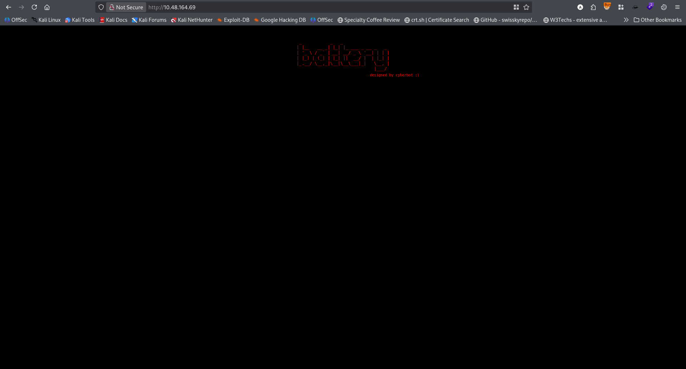 <br/>
Found nothing suspicious. So I performed directory bruteforcing. And found the following <br/>
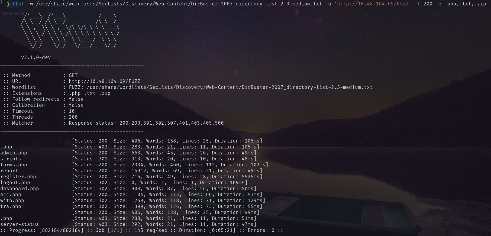 <br/>
So first I visited the `admin.php` <br/>
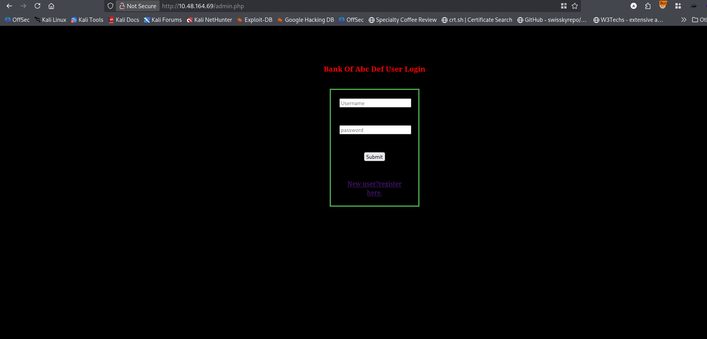 <br/>
Clicking the register button, I registered for new account. <br/>
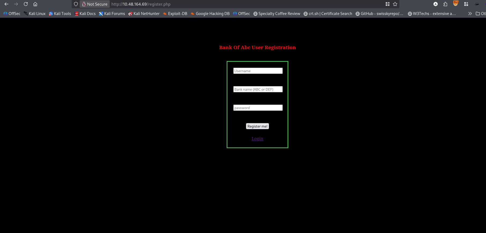 <br/>
And logged in. <br/>
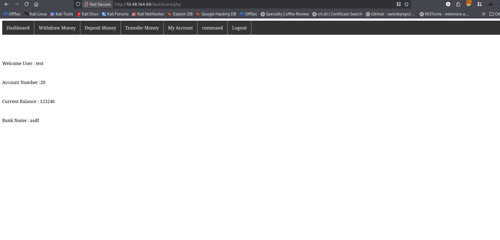 <br/>
But in my account page and command page needs to be admin user. <br/>
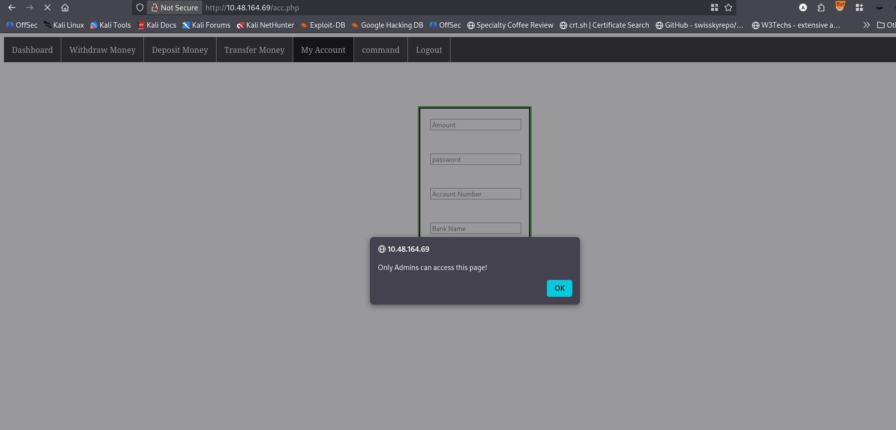 <br/>
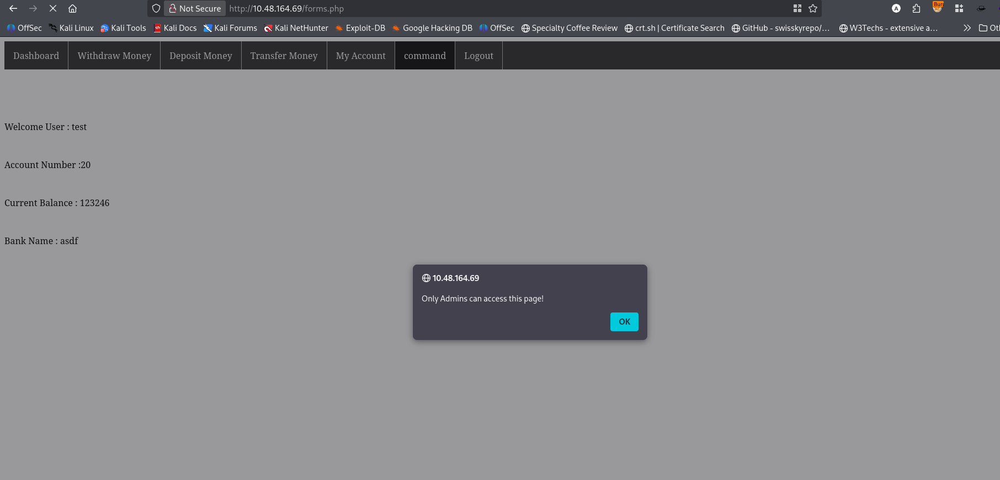 <br/>
But in form.php page I found XML input section. <br/>
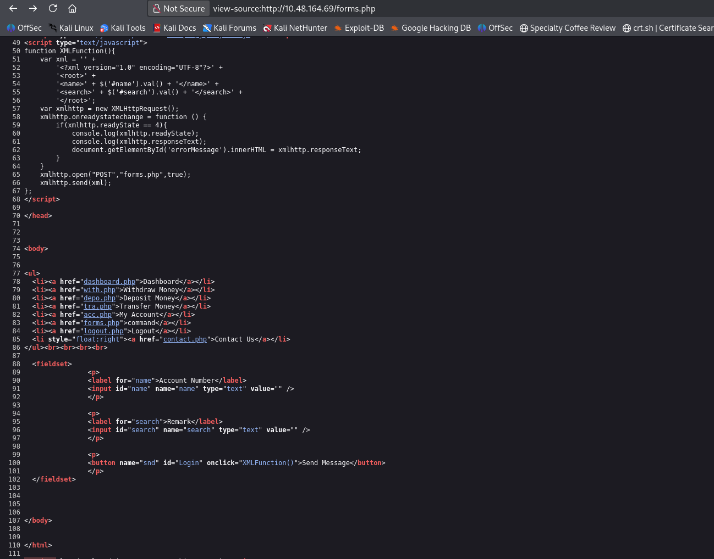 <br/>
But I needed to be admin to access this page. <br/>
I visited the `/report` and it download a binary. <br/>
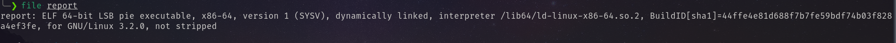 <br/>
I decompiled the binary and found the following code. 
```txt
void update(char *a0, unsigned long long a1)
{
    unsigned long long v0;  // [bp-0x18]

    v0 = a1;
    if (strcmp(a0, "admin@bank.a"))
    {
        puts("Sorry you can't update the password\n");
        options();
        return;
    }
    puts("Password Updated Successfully!\n");
    options();
    return;
}

void options(void)
{
    puts("Welcome Guest\n");
    puts("===================Available Options==============\n");
    puts("1. Check users");
    puts("2. Add user");
    puts("3. Delete user");
    puts("4. change password");
    puts("5. Exit");
    return;
}

void users(void)
{
    system("clear");
    puts("\n===============List of active users================");
    puts("support@bank.a");
    puts("contact@bank.a");
    puts("cyber@bank.a");
    puts("admins@bank.a");
    puts("sam@bank.a");
    puts("admin0@bank.a");
    puts("super_user@bank.a");
    puts("admin@bank.a");
    puts("control_admin@bank.a");
    puts("it_admin@bank.a\n\n");
    options();
    return;
}

unsigned int main(void)
{
    unsigned int i;  // [bp-0x8c]
    char v1[32];  // [bp-0x88]
    char v2[32];  // [bp-0x68]
    char v3[32];  // [bp-0x48]
    char v4[32];  // [bp-0x28]

    i = 0;
    puts("\n\n\n");
    puts("Welcome To ABC DEF Bank Managemet System!\n\n");
    printf("UserName : ");
    __isoc99_scanf("%s", v2);
    puts("\n");
    printf("Password : ");
    __isoc99_scanf("%s", v1);
    if (!strcmp(v2, "guest") && !strcmp(v1, "guest"))
    {
        options();
        while (i != 5)
        {
            printf("Your Choice : ");
            __isoc99_scanf("%d", (unsigned int)&i);
            if (i == 1)
            {
                users();
            }
            else if (i == 4)
            {
                printf("email : ");
                __isoc99_scanf("%s", v4);
                puts("\n");
                printf("Password : ");
                __isoc99_scanf("%s", v3);
                update(v4, v3);
            }
            else if (i == 3 || i == 2)
            {
                puts("not available for guest account\n");
                system("clear");
                options();
            }
            else
            {
                puts("Wrong option\n");
                system("clear");
                options();
            }
        }
        return 0;
    }
    printf("Wrong username or password");
    return 0;
}
```
So `admin@bank.a` is an admin account. So I tried to create an account with this name. But <br/>
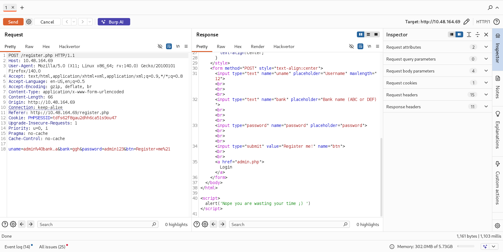 <br/>
So I just changed the name with `admin@bank.a+a`. And successfully created an account. <br/>
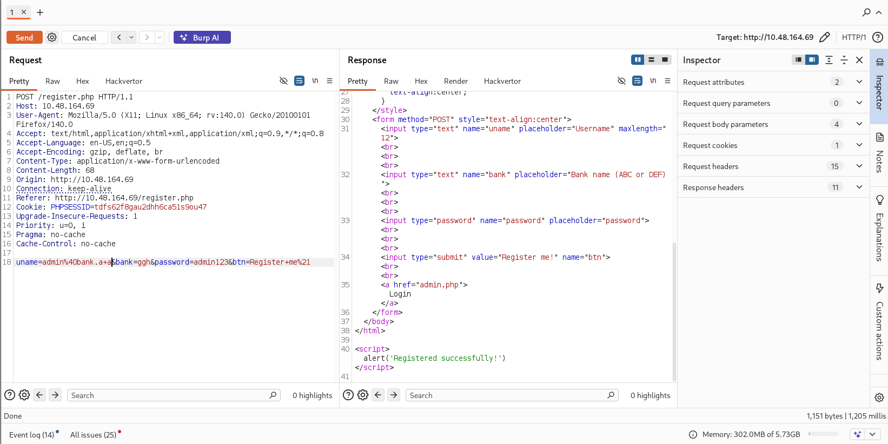 <br/>
Then I got access to the form page. <br/>
**This page was protected by simple client-side javascript. Try to bypass that.**
Then injecting XML payload I found XXE.  <br/>
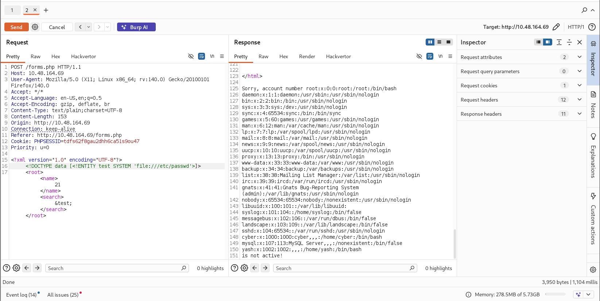 <br/>
Using php wraper I got the acc.php source code in bas64 encoded form.  <br/>
Decoding the encoded version I got the following  <br/>
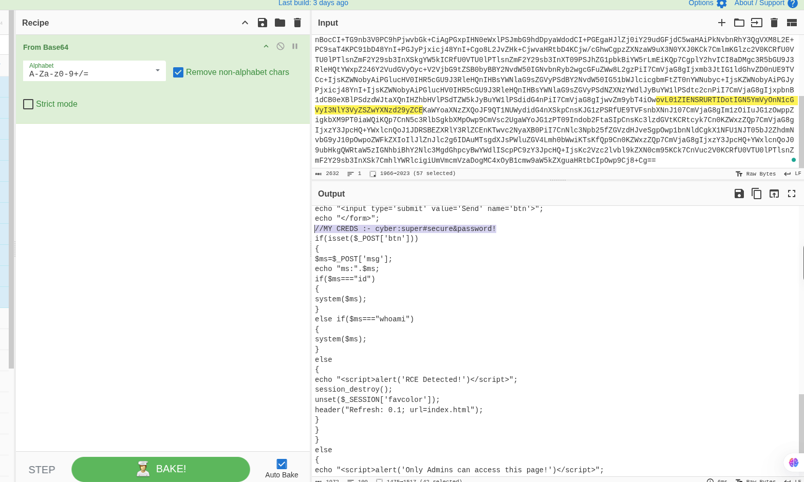 <br/>
Using the username and password I got access via ssh. <br/>
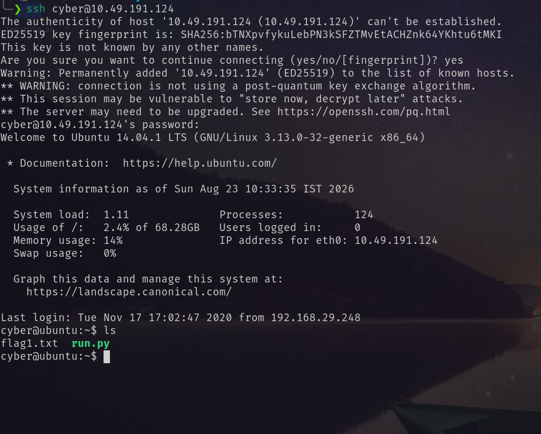 <br/>
# Privilege Escalation
I ran `sudo -l` and found: <br/>
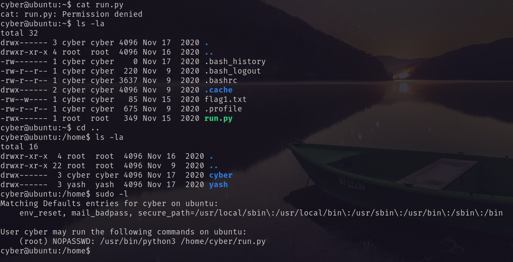 <br/>
I have write access on this directory. So created a new run.py with `/bin/bash` payload to be root. <br/>
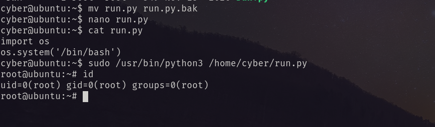 <br/>
